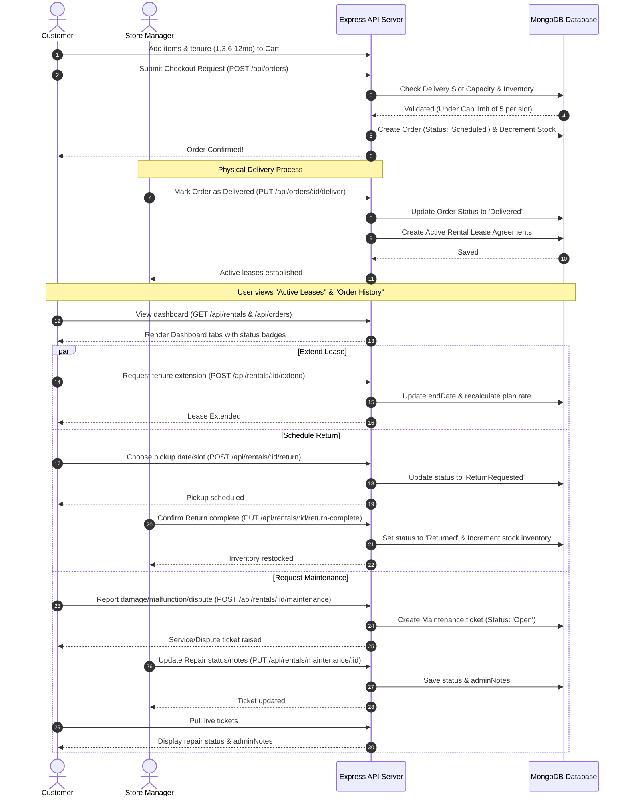
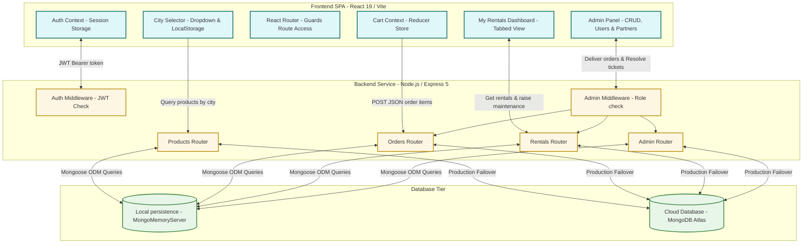

# 📦 RentEase - Premium Full-Stack Rental Platform

RentEase is a full-stack web application designed for renting furniture and home appliances. Built with a modern tech stack, RentEase provides flexible, tenure-based pricing subscriptions, location-specific product catalogs, an intuitive shopping cart, secure checkout, a dedicated customer portal, and a powerful administrator dashboard to manage orders, inventory CRUD, service areas, and business partners.

---

## 🌟 Core Features

### 👤 Customer Experience
- **Interactive Product Catalog:** Browse furniture and appliances with real-time text search, category tabs, and active service city filters.
- **Location-Specific Catalogs:** Choose your current city in the navigation bar to filter and view product availability tailored to your location.
- **Flexible Tenure Pricing Matrix:** Choose different rental durations (1, 3, 6, or 12 months) on individual product details; pricing scales dynamically (long-term leases cost less per month).
- **Advanced Shopping Cart:** Adjust quantities and modify tenures of items directly inside the cart. Refundable security deposits and monthly rent are calculated instantly.
- **Simulated Checkout & Payments:** Place rental bookings choosing preferred delivery slots and mock payments (credit/debit cards, UPI, or Net Banking).
- **My Rentals Dashboard:** Track active, scheduled, and completed rental agreements along with due dates. Users can request tenure extensions or schedule returns.
- **Complaints & Disputes Panel:** Customers can report damage, request replacements, or raise billing/damage disputes with preferred service slots.

### 🛡️ Administrative Controls
- **Metrics Dashboard:** View real-time analytics including Monthly Recurring Revenue (MRR), Asset Utilization Rate, active orders, and pending repair counts.
- **Product Inventory Management (CRUD UI):** Add new items, edit existing catalogs (modify descriptions, imageUrls, stock counts, deposits, operating cities), or remove products from the catalog.
- **Order & Returns Processing:** Mark scheduled bookings as delivered to establish active leases, and confirm pickup return requests to restock product inventory.
- **User Directory Monitoring:** Review registered customer and administrator accounts, roles, and profile information.
- **Service Areas & Partners Tab:** Configure operating cities where RentEase is active, and track seeded business partners (delivery, repair, and maintenance vendors) handling logistics.
- **CSV Data Export:** Generate and download comprehensive CSV reports for Orders History, Active Leases, or Complaints Logs directly from the dashboard.

### 🔑 Authentication & Security
- **JWT Authorization:** Secured API endpoints with token verification.
- **Role-Based Routing:** Protected page guards for customer routes (`/checkout`, `/my-rentals`) and administrator panels (`/admin`).
- **Autofill Quick-Login:** Quick-credentials buttons on the Login page for convenient testing.

---

## 🛠️ Technology Stack

| Layer | Technologies |
| :--- | :--- |
| **Frontend** | React 19, Vite, Tailwind CSS 3, React Router 7, Lucide Icons, Fetch API, Local Storage |
| **Backend** | Node.js, Express 5, Mongoose 9, JWT (JsonWebToken), BcryptJS, CORS, Dotenv |
| **Database** | MongoMemoryServer (Embedded for zero-config runs) or MongoDB Atlas |

---

## 📊 Process Flow Diagram

The following Mermaid diagram shows the complete lifecycle of a rental lease agreement, from choosing tenure plans to return delivery and repairs:



---

## 🏗️ Process-to-Process Architecture

RentEase follows a decoupled client-server architecture model ensuring high scalability and clear boundaries:



---

## 💡 Why This Design? (Architecture Decisions)

- **Tenure-Based Subscriptions**: Traditional e-commerce models use flat pricing. RentEase implements a dynamic pricing matrix (`pricing: { 1: X, 3: Y, 6: Z, 12: W }`). Choosing a longer lease duration lowers the monthly rental rate, reflecting real-world rental business models where long-term customer lock-in yields higher predictable LTV.
- **Physical Operations Alignment**: When a customer checkouts, a `Rental` is **not** immediately active. The system separates the checkout booking (`Order` set to `Scheduled`) from lease activation (`Rental` set to `Active`). A rental lease only starts when the product is physically delivered to the site, allowing shipping/lead time tracking.
- **Inventory Protection Lock**: When an order is placed, stock levels are decremented instantly to prevent over-booking. If the order is cancelled before delivery, stock is immediately restored.
- **Complaints & Disputes loop**: Maintenance requests are tied directly to active leases. By adding `adminNotes` and `status` updates on the ticket, RentEase ensures customers and support technicians have a synchronous communications channel.
- **Service Area Constraints**: Products are tagged with a target operating `city` (defaulting to 'All'). This allows scaling RentEase to multiple cities, restricting product catalog displays to match user location selector details.
- **Strict Registration Guards**: Normal user accounts require no keys, but registering a Manager account requires the private passcode (`Rent555`). This prevents arbitrary users from gaining administrative control in a real deployment.

---

## 📂 Project Structure

```
RentEase/
├── backend/
│   ├── config/          # DB connections and environment configs
│   ├── middleware/      # Auth guards and validation layers
│   ├── models/          # Mongoose schemas
│   │   ├── User.js        # User credentials and roles
│   │   ├── Product.js     # Catalog products with tenure matrix
│   │   ├── Order.js       # Order checkout slots and address
│   │   ├── Rental.js      # Active rental leases and returns
│   │   ├── Maintenance.js # Support tickets and disputes
│   │   ├── Business.js    # [NEW] Business partners and vendors
│   │   └── ServiceArea.js # [NEW] Active operating cities
│   ├── routes/          # API endpoint router files
│   ├── server.js        # Entry server point with automatic seeding logic
│   └── test.js          # API integration tests
│
├── frontend/
│   ├── public/          # Static assets
│   ├── src/
│   │   ├── components/  # Layout components (Navbar with City Selector)
│   │   ├── context/     # React state managers (AuthContext, CartContext)
│   │   ├── pages/       # Route pages
│   │   │   ├── Home.jsx           # Landing page
│   │   │   ├── Catalog.jsx        # Product catalog with city filter
│   │   │   ├── ProductDetail.jsx  # Tenure choice details
│   │   │   ├── Cart.jsx           # Quantity & Tenure adjustments
│   │   │   ├── Checkout.jsx       # Delivery date and slot selector
│   │   │   ├── MyRentals.jsx      # Active rentals & support tickets
│   │   │   ├── AdminDashboard.jsx # Stats, Order delivery, CRUD, Users, Partners, CSV Exports
│   │   │   ├── Login.jsx          # User quick log-in credentials
│   │   │   └── Register.jsx       # Registration with Manager passcode
│   │   ├── App.jsx      # Navigation routing & global providers
│   │   └── main.jsx     # Root rendering entry
```

---

## 🚀 Setup & Execution Guide

### Prerequisite
Ensure you have **Node.js (v18 or higher)** installed on your machine.

---

### Quick Start (Recommended)

From the project root directory, run both backend and frontend together:

```bash
# Install all dependencies (root, backend, frontend)
npm run install:all

# Start both backend and frontend with a single command
npm run dev
```

This will automatically:
- ✅ Start Backend on `http://localhost:5000`
- ✅ Start Frontend on `http://localhost:5173`
- ✅ Initialize MongoDB with in-memory server
- ✅ Auto-seed Products, Admin/User Accounts, Service Areas, and Business Partners
- ✅ Setup API proxy between frontend and backend

---

### Alternative: Run Backend & Frontend Separately

#### Step 1: Run the Backend Server

1. Open your terminal and navigate to the `backend` folder:
   ```bash
   cd backend
   ```
2. Install dependencies:
   ```bash
   npm install
   ```
3. Configure Environment Variables (Optional):
   By default, the server spins up an **in-memory database** (`mongodb-memory-server`) with local persistence in the `backend/.mongodb_data` directory. If you want to connect to your own MongoDB database instead, create a `.env` file in the `backend` folder and add:
   ```env
   PORT=5000
   JWT_SECRET=your_jwt_secret_key
   MONGODB_URI=mongodb://localhost:27017/rentease
   ```
4. Start the development server:
   ```bash
   npm run dev
   ```
   *The server runs on `http://localhost:5000`.*

---

#### Step 2: Run the Frontend App

1. Open a new terminal window/tab and navigate to the `frontend` folder:
   ```bash
   cd frontend
   ```
2. Install dependencies:
   ```bash
   npm install
   ```
3. Start the dev server:
   ```bash
   npm run dev
   ```
   *The application will boot on `http://localhost:5173`.*

---

## 🧪 Testing

To run backend integration tests:
1. In the `backend` directory, run:
   ```bash
   npm test
   ```
   *This programmatically checks user register/login flows, product seedings, and order checkout sequences.*

---

## 🔑 Access & Role Setup

For testing and initial execution:
- **Boot Seeding**: The server automatically boots up with default accounts in clean databases (`user@rentease.com`/`user123` as a standard Customer, and `admin@rentease.com`/`admin123` as a Manager).
- **Service Areas & Partners Seeding**: Automatically seeds active cities (Bangalore, Delhi, Mumbai, Pune, Hyderabad) and business partners (Swift Logistics, FixIt Squad, Clean & Shine) on database boot.
- **Manager Signups**: Select **I'm a Manager** on the registration page and input the authorization key **`Rent555`** to secure administrative privileges.
- **Customer Signups**: Standard registrations require no passcode.

---

## 🔌 API Documentation Summary

### 🔐 Authentication (`/api/auth`)
- `POST /register` - Create user account (accepts optional `secretKey` for managers).
- `POST /login` - Log in and obtain session JWT token.
- `GET /me` - Retrieve profile info of currently logged-in user.

### 📦 Products (`/api/products`)
- `GET /` - Fetch catalog products (supports searching, category, and city query parameters).
- `GET /:id` - Retrieve details of a single product.
- `POST /` - **(Admin)** Create a new product.
- `PUT /:id` - **(Admin)** Edit details of an existing product.
- `DELETE /:id` - **(Admin)** Delete a product.

### 🛒 Orders & Checkout (`/api/orders`)
- `POST /` - Place a new order (creates a `Scheduled` order).
- `GET /` - Fetch orders history for the authenticated user.
- `GET /all` - **(Admin)** Fetch all orders submitted on the platform.
- `PUT /:id/deliver` - Mark order as `Delivered` and establish active leases.
- `PUT /:id/cancel` - Cancel order and restore product inventories.

### 📅 Rentals & Leases (`/api/rentals`)
- `GET /` - Fetch active/extended/return-scheduled rentals for the current customer.
- `POST /:id/extend` - Extend an active rental lease by `1`, `3`, `6`, or `12` months.
- `POST /:id/return` - Request return pickup date & timing slot (sets status to `ReturnRequested`).
- `POST /:id/maintenance` - Raise a repair/service ticket or billing/damage dispute.
- `GET /maintenance/user` - Fetch list of repair tickets raised by the current user.
- `GET /admin/all` - **(Admin)** Fetch all active leases in the system.
- `GET /maintenance/all` - **(Admin)** Fetch all maintenance complaints and disputes.
- `PUT /maintenance/:id` - **(Admin)** Update maintenance ticket status and save admin response notes.
- `PUT /:id/return-complete` - **(Admin)** Confirm return pickup, set rental status to `Returned`, and restore inventory levels.

### 🛡️ Admin Operations (`/api/admin`)
- `GET /stats` - **(Admin)** Fetch dashboard metrics (MRR, stock levels, utilization rate, etc.).
- `GET /users` - **(Admin)** Fetch list of all registered accounts.
- `GET /businesses` - **(Admin)** Fetch all business partner vendors.
- `GET /service-areas` - Fetch active service cities.
- `POST /service-areas` - **(Admin)** Create a new active service city.
- `PUT /service-areas/:id` - **(Admin)** Update city details or toggle status.
- `DELETE /service-areas/:id` - **(Admin)** Remove a service area.
