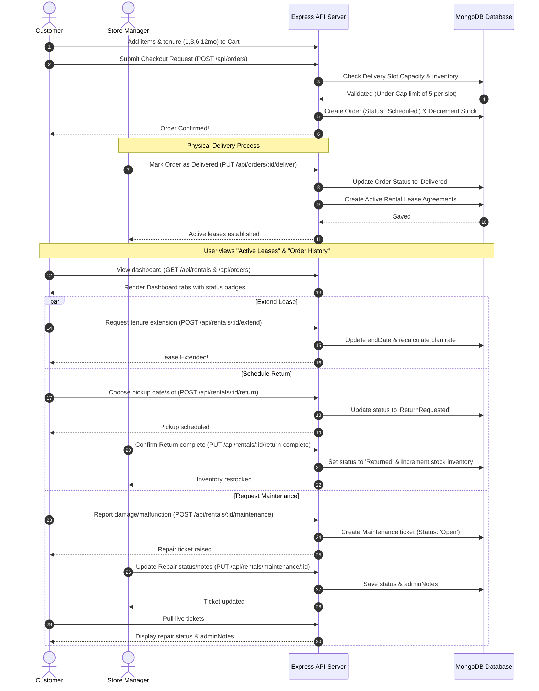
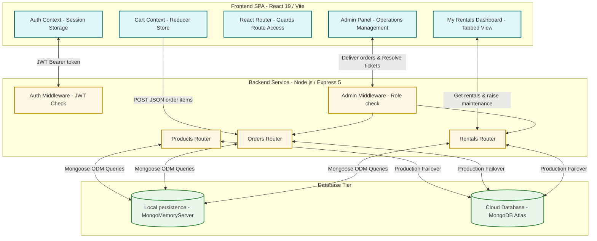

# 📦 RentEase - Premium Full-Stack Rental Platform

RentEase is a full-stack web application designed for renting furniture and home appliances. Built with a modern tech stack, RentEase provides flexible, tenure-based pricing subscriptions, an intuitive shopping cart, secure checkout, a dedicated customer portal, and a powerful administrator dashboard.

---

## 🌟 Core Features

### 👤 Customer Experience
- **Interactive Product Catalog:** Browse furniture and appliances with real-time text search and category filters.
- **Flexible Tenure Pricing Matrix:** Choose different rental durations (1, 3, 6, or 12 months) on individual product details; pricing scales dynamically.
- **Advanced Shopping Cart:** Adjust quantities and modify tenures of items directly inside the cart. Refundable security deposits and monthly rent are calculated instantly.
- **Simulated Checkout & Payments:** Place rental bookings using mock credit/debit cards, UPI, or Net Banking options.
- **My Rentals Dashboard:** Track active, scheduled, and completed rental agreements along with due dates.

### 🛡️ Administrative Controls
- **Metrics Dashboard:** View real-time analytics including total orders, active subscriptions, cumulative revenue, and stock count.
- **Product Inventory Management (CRUD):** Add, update, and manage products, upload image URLs, configure tenure-based pricing structures, and control inventory.
- **Order Processing:** Oversee customer rental requests and process pending orders.

### 🔑 Authentication & Security
- **JWT Authorization:** Secured endpoints with token verification.
- **Role-Based Routing:** Protected page guards for customer routes (`/checkout`, `/my-rentals`) and administrator panels (`/admin`).
- **Autofill Quick-Login:** Quick-credentials buttons on the Login page for convenient testing.

---

## 🛠️ Technology Stack

| Layer | Technologies |
| :--- | :--- |
| **Frontend** | React 19, Vite, Tailwind CSS 3, React Router 7, Lucide Icons, Fetch API |
| **Backend** | Node.js, Express 5, Mongoose 9, JWT (JsonWebToken), BcryptJS, CORS, Dotenv |
| **Database** | MongoMemoryServer (Embedded for zero-config runs) or MongoDB Atlas |

---

## 📊 Process Flow Diagram

The following Mermaid diagram shows the complete lifecycle of a rental lease agreement, from choosing tenure plans to return delivery and repairs:



---

## 🏗️ Process-to-Process Architecture

RentEase follows a decoupled client-server architecture model ensuring high scalability and clear boundaries:



### ⚙️ Architecture Detail
1. **Frontend (Client Process)**:
   - Built as a Single Page Application (SPA). React context provides global hooks (`useAuth`, `useCart`) to prevent redundant API fetches.
   - Client-side navigation guards route security. Normal users are isolated from `/admin` endpoints, and guests are redirected to `/login` when trying to checkout.
2. **Backend (Server Process)**:
   - Express runs an asynchronous REST API.
   - JWT tokens are validated statelessly using symmetric keys on the `Authorization` header.
   - Separate router scopes manage collections.
3. **Database (Data Process)**:
   - For simple local setups, `mongodb-memory-server` spins up a virtual Mongo instance in the background. It persists data to a local `.mongodb_data` directory, meaning developers do not need to install MongoDB on their machine.
   - Transitioning to production requires setting the environment variable `MONGODB_URI` to connect directly to a live cluster.

---

## 💡 Why This Design? (Architecture Decisions)

- **Tenure-Based Subscriptions**: Traditional e-commerce models use flat pricing. RentEase implements a dynamic pricing matrix (`pricing: { 1: X, 3: Y, 6: Z, 12: W }`). Choosing a longer lease duration lowers the monthly rental rate, reflecting real-world rental business models where long-term customer lock-in yields higher predictable LTV (Lifetime Value).
- **Physical Operations Alignment**: When a customer checkouts, a `Rental` is **not** immediately active. The system separates the checkout booking (`Order` set to `Scheduled`) from lease activation (`Rental` set to `Active`). A rental lease only starts when the product is physically delivered to the site, allowing shipping/lead time tracking.
- **Inventory Protection Lock**: When an order is placed, stock levels are decremented instantly to prevent over-booking. If the order is cancelled before delivery, stock is immediately restored.
- **Complaints loop**: Maintenance requests are tied directly to active leases. By adding `adminNotes` and `status` updates on the ticket, RentEase ensures customers and support technicians have a synchronous communications channel.
- **Strict Registration Guards**: Normal user accounts require no keys, but registering a Manager account requires the private passcode (`Rent555`). This prevents arbitrary users from gaining administrative control in a real deployment.

---

## 📂 Project Structure

```
RentEase/
├── backend/
│   ├── config/          # DB connections and environment configs
│   ├── middleware/      # Auth guards and validation layers
│   ├── models/          # Mongoose schemas (User, Product, Order, Rental)
│   ├── routes/          # API endpoint router files
│   ├── server.js        # Entry server point with automatic seeding logic
│   └── test.js          # API integration tests
│
├── frontend/
│   ├── public/          # Static assets
│   ├── src/
│   │   ├── components/  # Layout components (Navbar, etc.)
│   │   ├── context/     # React state managers (AuthContext, CartContext)
│   │   ├── pages/       # Route pages (Home, Catalog, AdminDashboard, etc.)
│   │   ├── App.jsx      # Navigation routing & global providers
│   │   └── main.jsx     # Root rendering entry
```

---

## 🚀 Setup & Execution Guide

### Prerequisite
Ensure you have **Node.js (v18 or higher)** installed on your machine.

---

### Quick Start (Recommended)

From the project root directory, run both backend and frontend together:

```bash
# Install all dependencies (root, backend, frontend)
npm run install:all

# Start both backend and frontend with a single command
npm run dev
```

This will automatically:
- ✅ Start Backend on `http://localhost:5000`
- ✅ Start Frontend on `http://localhost:5173`
- ✅ Initialize MongoDB with in-memory server
- ✅ Setup API proxy between frontend and backend

---

### Alternative: Run Backend & Frontend Separately

#### Step 1: Run the Backend Server

1. Open your terminal and navigate to the `backend` folder:
   ```bash
   cd backend
   ```
2. Install dependencies:
   ```bash
   npm install
   ```
3. Configure Environment Variables (Optional):
   By default, the server spins up an **in-memory database** (`mongodb-memory-server`) with local persistence in the `backend/.mongodb_data` directory. If you want to connect to your own MongoDB database instead, create a `.env` file in the `backend` folder and add:
   ```env
   PORT=5000
   JWT_SECRET=your_jwt_secret_key
   MONGODB_URI=mongodb://localhost:27017/rentease
   ```
4. Start the development server:
   ```bash
   npm run dev
   ```
   *The server runs on `http://localhost:5000`.*

---

#### Step 2: Run the Frontend App

1. Open a new terminal window/tab and navigate to the `frontend` folder:
   ```bash
   cd frontend
   ```
2. Install dependencies:
   ```bash
   npm install
   ```
3. Start the dev server:
   ```bash
   npm run dev
   ```
   *The application will boot on `http://localhost:5173`.*

### 🛠️ Editor Configuration (VS Code)

To suppress CSS linting warnings for Tailwind directives (e.g., `@tailwind`, `@apply`, `@layer`) in VS Code, a workspace configuration is included in `.vscode/settings.json`:
```json
{
  "css.lint.unknownAtRules": "ignore"
}
```
*Tip: Installing the official **Tailwind CSS IntelliSense** extension is highly recommended for autocomplete and automatic syntax support.*

---

### 📝 Setup Files & Configuration

The project has been configured for seamless full-stack development:

| File | Purpose |
|------|---------|
| `package.json` (root) | Root-level scripts to run backend & frontend together |
| `scripts/dev.js` | Custom launcher for parallel backend/frontend execution |
| `frontend/vite.config.js` | API proxy configuration for development (routes `/api` to backend) |
| `frontend/src/config.js` | Dynamic API URL configuration (uses proxy in dev, direct URL in production) |
| `vercel.json` (root) | Vercel deployment configuration for full-stack app |

**Key Features:**
- 🔄 Single command to start both services
- 🔗 Automatic API proxy between frontend and backend
- 📦 In-memory MongoDB with local persistence
- 🚀 Ready for Vercel deployment

---

## 🧪 Testing

To run backend integration tests:
1. In the `backend` directory, run:
   ```bash
   npm test
   ```
   *This programmatically checks user register/login flows, product seedings, and order dispatch sequences.*

---

## 🔑 Access & Role Setup

For testing and initial execution:
- **Boot Seeding**: The server automatically boots up with default accounts in clean databases (`user@rentease.com`/`user123` as a standard Customer, and `admin@rentease.com`/`admin123` as a Manager).
- **Manager Signups**: Select **I'm a Manager** on the registration page and input the authorization key **`Rent555`** to secure administrative privileges.
- **Customer Signups**: Standard registrations require no passcode.

---

## 🔌 API Documentation Summary

### 🔐 Authentication (`/api/auth`)
- `POST /register` - Create user account (accepts optional `secretKey` for managers).
- `POST /login` - Log in and obtain session JWT token.
- `GET /me` - Retrieve profile info of currently logged-in user.

### 📦 Products (`/api/products`)
- `GET /` - Fetch catalog products (supports searching & category parameters).
- `GET /:id` - Retrieve details of a single product.

### 🛒 Orders & Checkout (`/api/orders`)
- `POST /` - Place a new order (creates a `Scheduled` order).
- `GET /` - Fetch orders history for the authenticated user.
- `GET /all` - **(Admin)** Fetch all orders submitted on the platform.
- `PUT /:id/deliver` - Mark order as `Delivered` and establish active leases.
- `PUT /:id/cancel` - Cancel order and restore product inventories.

### 📅 Rentals & Leases (`/api/rentals`)
- `GET /` - Fetch active/extended/return-scheduled rentals for the current customer.
- `POST /:id/extend` - Extend an active rental lease by `1`, `3`, `6`, or `12` months.
- `POST /:id/return` - Request return pickup date & timing slot (sets status to `ReturnRequested`).
- `POST /:id/maintenance` - Raise a repair/service ticket for active leases.
- `GET /maintenance/user` - Fetch list of repair tickets raised by the current user.
- `GET /admin/all` - **(Admin)** Fetch all active leases in the system.
- `GET /maintenance/all` - **(Admin)** Fetch all maintenance complaints.
- `PUT /maintenance/:id` - **(Admin)** Update maintenance ticket status (Open -> In Progress -> Resolved -> Cancelled) and save admin response notes.
- `PUT /:id/return-complete` - **(Admin)** Confirm return pickup, set rental status to `Returned`, and restore inventory levels.
